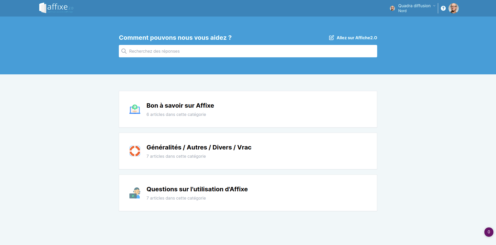
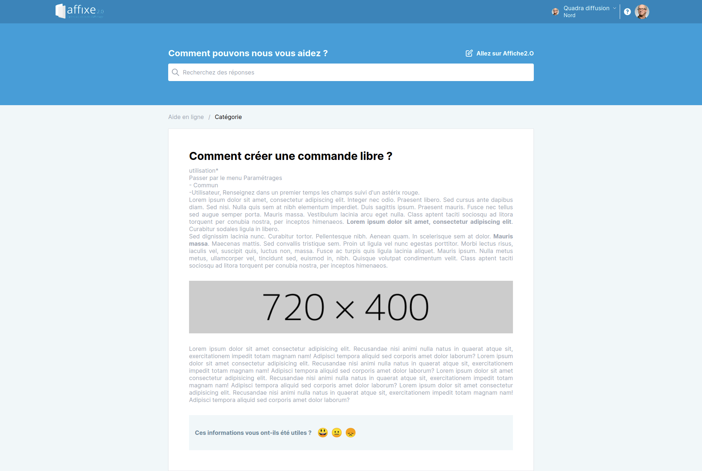
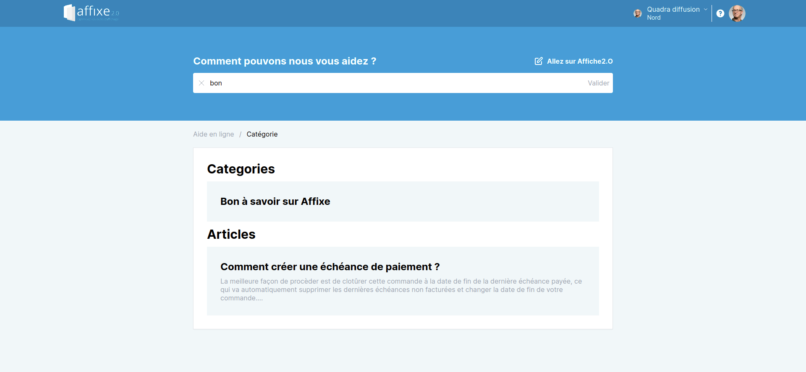

# Demo

[Click over here for the demo](https://res.cloudinary.com/dkc7uggjy/video/upload/v1619233409/quadra/demo.mp4)


# Stack

- Vuejs (2) / Nuxt.js (ssr friendly)
- Tailwind
- Express.js
- Couchbase 7.0.0 (beta)
- Cypress for frontend testing
- Jest for backend testing

# Folder structure

- api -> api folder
  - api/seed.js -> seeding function
- frontend -> frontend folder
- demos -> screenshots and video for demo purpose


# How to reproduce ?

## cloning repo

```bash
$ git clone https://github.com/kayode-adechinan/knowledge-base-app
```

## installing package for frontend

```bash
$ cd api
$ npm install
```

## installing package for backend

```bash
$ cd frontend
$ npm install
```

## set env config

- replace frontend/.env.sample by .env
- update vars accordingly to your config
- replace api/.env.sample by .env
- update vars accordingly to your config


## installing couchbase 7.0.0 (beta) on ubuntu 20

[download](https://packages.couchbase.com/releases/7.0.0-beta/couchbase-server-community_7.0.0-beta-ubuntu20.04_amd64.deb)

## Setting up cluster

[how to setup cluster](https://res.cloudinary.com/dkc7uggjy/video/upload/v1619233398/quadra/setup-cluster.mp4)

## Database seeding

```bash

$ cd api
$ npm run test
```

# Testing

- Frontend (cypress)

```bash

$ cd frontend
$ npm run cypress:test
```

- Backend (jest)

```bash

$ cd api
$ npm run test
```

# Launch server

```bash

$ cd api
$ npm run dev
```

# Launch frontend

```bash

$ cd frontend
$ npm run dev
```

# Quel est le meilleur Framework Web VueJS, Angular et ReactJS ?

[Response ](https://docs.google.com/document/d/19YYtJhyOSnP7CpbtPgD33mc-h9FnBdNNUFwkrJFvCko/edit?usp=sharing)

# Comment peut-on s’assurer qu’une Appli Web soit compatible sur tous les Devices actuels (Desktop, Tablet, Mobile) ?

[Response ](https://docs.google.com/document/d/1_S3nNPflnwyxs1ZgNPqFlWhxPWpVSB2HQHnkg-c6Xbk/edit?usp=sharing)


# Screenshots







# Backup / Restore commands

```bash

$ /opt/couchbase/bin/cbbackup http://localhost:8091 ~/backups -u couchbase -p couchbase  -b faqdb 

```

```bash

$ /opt/couchbase/bin/cbrestore ~/backups http://localhost:8091 -u couchbase -p couchbase -b faqdb -B faqdb

```